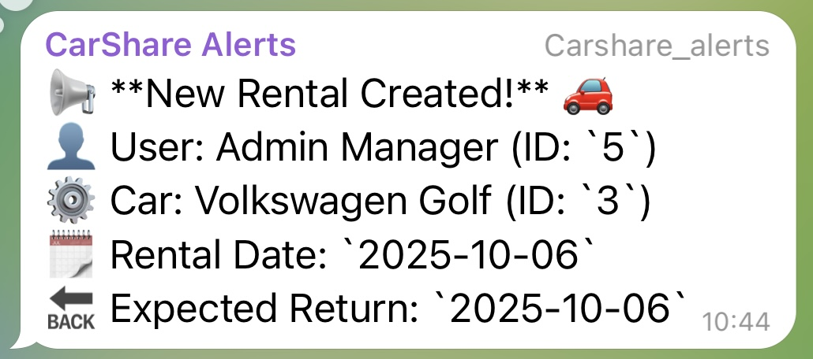
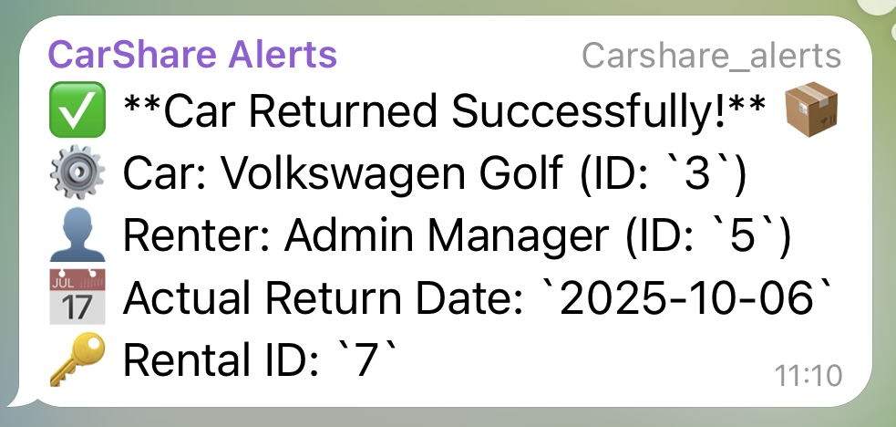
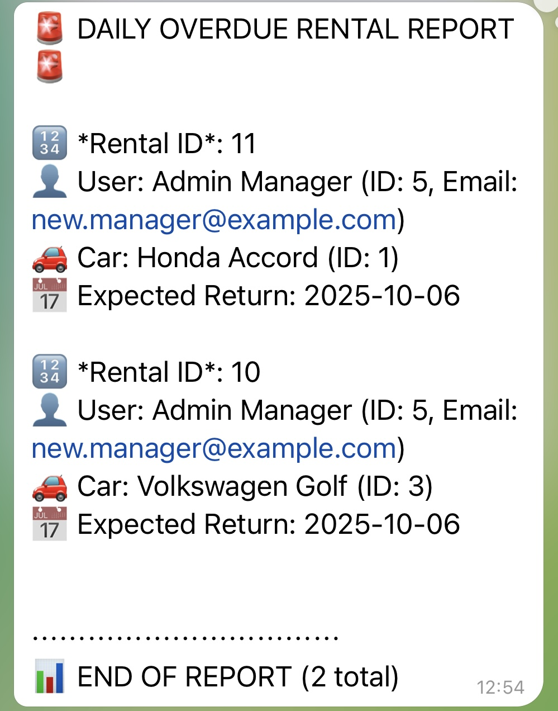
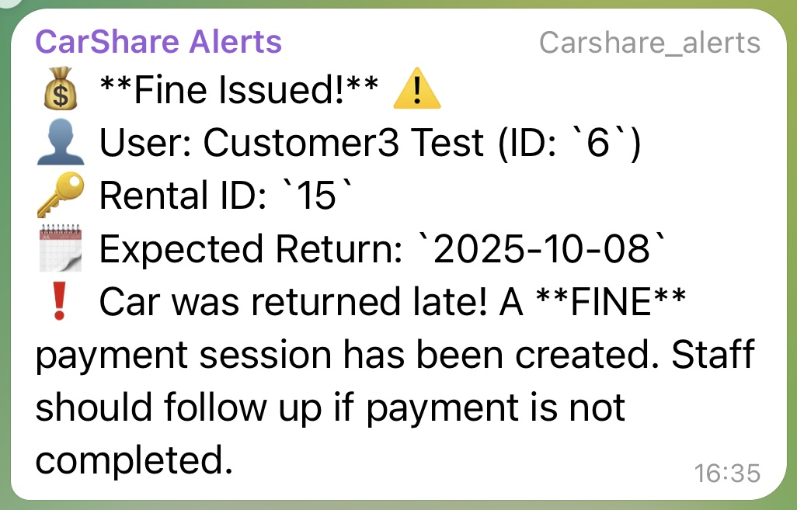
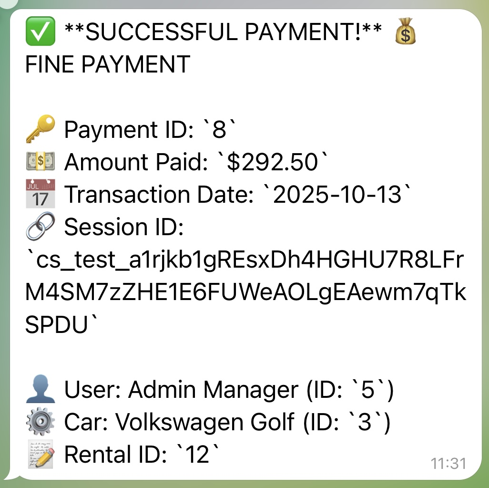

# 🚗 Car Sharing App

An online car rental management system built with **Spring Boot** and **Java 17**, designed to modernize the operations of a city car sharing service.  
It replaces the outdated manual record-keeping system with a robust, web-based platform that supports user registration, rental tracking, payments, and notifications.

---

## 🧩 Overview

The **Car Sharing App** streamlines car rental operations by allowing users to register, rent cars, make payments via **Stripe**, and receive notifications via **Telegram**.  
Administrators can manage vehicles, monitor rentals, and track payments in real time. 

---

## 🌟 Features

| Category | Description |
|-----------|-------------|
| **User Management** | Registration, authentication, profile management, role updates |
| **Car Inventory** | Add, update, delete, and list cars with inventory tracking |
| **Rental Management** | Create rentals, return cars, view rental history |
| **Payments (Stripe)** | Secure payment sessions with Stripe API for rentals and fines |
| **Notifications (Telegram)** | Automatic Telegram messages for new, overdue, and paid rentals |
| **Scheduling** | Daily check for overdue rentals using Spring's `@Scheduled` tasks |
| **Security** | JWT token-based authentication, Checkstyle for code quality |
| **CI/CD** | GitHub Actions pipeline for Maven builds (`mvn clean verify`) |
| **Documentation** | Swagger UI auto-generated API docs |

---

## 🏗️ Architecture

The application follows a **layered architecture** pattern:
- **Controllers** handle HTTP requests and return responses
- **Services** contain business logic
- **Repositories** manage data persistence
- **Mappers** convert between entities and DTOs
- **External integrations** (Stripe, Telegram) are isolated in separate services


## 📂 Project Structure
```
car-sharing-app/
├── src/
│   ├── main/
│   │   ├── java/com/example/carsharingapp/
│   │   │   ├── config/          # Security, Swagger, Telegram configs
│   │   │   ├── controller/      # REST API endpoints
│   │   │   ├── dto/             # Data Transfer Objects
│   │   │   ├── model/           # JPA Entities
│   │   │   ├── exception/       # Custom exceptions
│   │   │   ├── mapper/          # Entity-DTO mappers
│   │   │   ├── repository/      # Spring Data JPA repositories
│   │   │   ├── security/        # JWT authentication
│   │   │   ├── service/         # Business logic
│   │   │   └── validation/      # Custom validators
│   │   └── resources/
│   │       ├── db/changelog/    # Liquibase migrations
│   │       └── application.properties
│   └── test/                    # Unit & Integration tests
├── docs/                        # Documentation & screenshots
├── .github/workflows/           # CI/CD pipeline
├── docker-compose.yaml
├── Dockerfile
├── .env.sample
└── pom.xml
```

---

## 🧰 Technologies Used
- **Language:** Java 17  
- **Framework:** Spring Boot 3.x  
- **Database:** MySQL  
- **ORM:** Spring Data JPA  
- **Database Migration:** Liquibase  
- **Security:** Spring Security, JWT  
- **Payments:** Stripe API  
- **Notifications:** Telegram Bot API  
- **Testing:** JUnit, Mockito  
- **Build Tool:** Maven  
- **CI/CD:** GitHub Actions  
- **Containerization:** Docker, Docker Compose  
- **Documentation:** Swagger/OpenAPI  

---

## ⚙️ System Requirements
- Java 17+
- Maven 3.9+
- Docker & Docker Compose
- MySQL 8+
- Stripe test account
- Telegram Bot token

---

## 🧭 Installation

### 1. Clone the repository
```bash
git clone https://github.com/DariaBakal/car-sharing-app.git
cd car-sharing-app
```

### 2. Configure Environment
Copy the provided `.env.template` and fill in your secrets:
```bash
cp .env.template .env
```

Update values for:
```ini
MYSQL_USER=root
MYSQL_ROOT_PASSWORD=root
MYSQL_DATABASE=carsharing
MYSQL_LOCAL_PORT=3307
MYSQL_DOCKER_PORT=3306

SPRING_LOCAL_PORT=8080
SPRING_DOCKER_PORT=8080
DEBUG_PORT=5005

JWT_SECRET=your_jwt_secret_key_here

TELEGRAM_BOT_TOKEN=your_telegram_bot_token
TELEGRAM_CHAT_ID=your_chat_id

STRIPE_SECRET_KEY=sk_test_**************
```

### 3. Build the project
```bash
mvn clean package
```

---

## 🔧 Configuration

| File | Purpose |
|------|---------|
| `.env` | Environment variables for secrets |
| `application.properties` | Spring Boot configuration |
| `liquibase.properties` | Database changelog settings |
| `checkstyle.xml` | Code quality enforcement |
| `.github/workflows/ci.yml` | Continuous integration pipeline |

> ⚠️ **Security Note:** The `.env` file contains sensitive data and is git-ignored. Always use `.env.template` as a template.

---

## ▶️ Running the Application

### Option 1: Local Run
```bash
mvn spring-boot:run
```

### Option 2: Docker Compose
```bash
docker-compose up --build
```
This will start the app and the MySQL database.

### Health Check
Visit:
```
http://localhost:8080/actuator/health
```

### Swagger UI
```
http://localhost:8080/swagger-ui/index.html
```

---

## 🔌 API Endpoints (Overview)

### Authentication
| Method | Endpoint | Description |
|--------|----------|-------------|
| POST | `/register` | Register new user |
| POST | `/login` | Obtain JWT token |

### Users
| Method | Endpoint | Description |
|--------|----------|-------------|
| GET | `/users/me` | Get current user profile |
| PUT/PATCH | `/users/me` | Update user profile |
| PUT | `/users/{id}/role` | Update user role |

### Cars
| Method | Endpoint | Description |
|--------|----------|-------------|
| GET | `/cars` | List all cars |
| GET | `/cars/{id}` | Get car by ID | 
| POST | `/cars` | Add a new car (admin only) |
| PUT/PATCH | `/cars/{id}` | Update car details (admin only) |
| DELETE | `/cars/{id}` | Remove a car (admin only) |

### Rentals
| Method | Endpoint | Description |
|--------|----------|-------------|
| POST | `/rentals` | Create a rental |
| GET | `/rentals` | List rentals (filtered by user or status) |
| GET | `/rentals/{id}` | Get rental by ID |
| POST | `/rentals/{id}/return` | Mark rental as returned |

### Payments
| Method | Endpoint | Description |
|--------|----------|-------------|
| GET | `/payments` | List payments |
| GET | `/payments/{id}` | "Get payment by ID |
| POST | `/payments/checkout` | Create payment session |
| POST | `/payments/renew/{paymentId}` | Renew an expired/cancelled payment session |
| GET | `/payments/success` | Stripe success callback |
| GET | `/payments/cancel` | Stripe cancel callback |

---

## 🗃️ Database Management

Database migrations are handled via **Liquibase**.

All changelogs are stored under:
```
src/main/resources/db/changelog/
```

Master file: `db.changelog-master.yaml`

To update or rollback the database schema:
```bash
mvn liquibase:update
mvn liquibase:rollback -Dliquibase.rollbackCount=1
```

---

## 🧪 Testing & CI/CD

Unit and integration tests are written using **JUnit 5** and **Mockito**.

**Test coverage:** ≥60% custom code.

CI/CD workflow runs automatically via **GitHub Actions** on each push or pull request:
```bash
mvn clean verify
```

---

## 🐳 Docker Setup

### Build and Run
```bash
docker-compose up --build
```

### Dockerfile
Defines a production-ready image for the Spring Boot app.

### docker-compose.yaml
Includes services for:
- Spring Boot backend
- MySQL database
- Environment variables loaded from `.env`

---

## 📢 Telegram Notifications

The application integrates with **Telegram Bot API** to send real-time notifications to administrators about important events in the car sharing service.

### 🔔 Notification Types

#### 1️⃣ New Rental Created 🚗


Triggered when a user successfully creates a new rental.

**Contains:**
- 📢 Announcement: "New Rental Created!"
- 👤 User information (ID and name)
- ⚙️ Car details (model and ID)
- 📅 Rental date
- 🔙 Expected return date

---

#### 2️⃣ Car Returned Successfully 📦


Triggered when a user returns a rented car.

**Contains:**
- ✅ Confirmation: "Car Returned Successfully!"
- ⚙️ Car details (model and ID)
- 👤 Renter information
- 📅 Actual return date
- 🔑 Rental ID

---

#### 3️⃣ Daily Overdue Rental Report 🚨


Scheduled task runs **daily** to check for overdue rentals.

**Contains:**
- 🚨 Report title: "DAILY OVERDUE RENTAL REPORT"
- 📋 List of all overdue rentals with:
  - Rental ID
  - User details (ID and email)
  - Car information
  - Expected return date
- 📊 Summary: "END OF REPORT (X total)"

**Configuration**:
The schedule can be configured in application.properties:
```properties
rental.overdue.check.cron=0 0 8 * * ?  # Runs daily at 08:00 AM
```

---

#### 4️⃣ No Overdue Rentals ✅


When the daily check finds **no overdue rentals**.

**Message:** "No rentals overdue today!"

---

#### 5️⃣ Fine Issued ⚠️


Triggered when a car is returned late and a **FINE payment session** is created.

**Contains:**
- 💰 Alert: "Fine Issued!"
- 👤 User information
- 🔑 Rental ID
- 📅 Expected return date
- ❗ Explanation: "Car was returned late! A **FINE** payment session has been created. Staff should follow up if payment is not completed."

---

#### 6️⃣ Successful Payment 💳


Triggered when a payment (rental or fine) is successfully processed via Stripe.

**Contains:**
- ✅ Confirmation: "SUCCESSFUL PAYMENT!"
- 💰 Payment type (PAYMENT or FINE)
- 🔑 Payment ID
- 💵 Amount paid
- 📅 Transaction date
- 🔗 Stripe session ID
- 👤 User details
- ⚙️ Car information
- 📝 Rental ID

---

### 🤖 Setting Up Telegram Bot

#### Step 1: Create a Telegram Bot
1. Open Telegram and find [@BotFather](https://t.me/botfather)
2. Send `/newbot` command
3. Follow the instructions to choose a name and username
4. **Copy the bot token** (looks like: `123456789:ABCdefGHIjklMNOpqrsTUVwxyz`)

#### Step 2: Create a Chat/Channel
1. Create a new channel or group in Telegram
2. Add your bot as an administrator
3. Post any message in the channel

#### Step 3: Get Chat ID
1. Find [@userinfobot](https://t.me/userinfobot) or use this method:
2. Visit: `https://api.telegram.org/bot<YOUR_BOT_TOKEN>/getUpdates`
3. Look for `"chat":{"id":-1001234567890}` in the response
4. **Copy the chat ID** (including the minus sign if present)

#### Step 4: Configure Environment Variables
Add to your `.env` file:
```ini
TELEGRAM_BOT_TOKEN=123456789:ABCdefGHIjklMNOpqrsTUVwxyz
TELEGRAM_CHAT_ID=-1001234567890
```

#### Step 5: Test the Integration
Start your application and create a test rental. You should receive a notification in your Telegram chat! 🎉

---


### 🛡️ Security Notes

- ⚠️ **Never commit** your bot token or chat ID to GitHub!
- ✅ Always use environment variables (`.env` file)
- ✅ Add `.env` to `.gitignore`
- ✅ Provide only `.env.template` with placeholder values in the repository

---


## 🧭 Troubleshooting

| Issue | Solution |
|-------|----------|
| App won't start | Check `.env` variables and database connection |
| Stripe payment not working | Verify test keys in Stripe dashboard |
| Telegram notifications missing | Ensure `TELEGRAM_BOT_TOKEN` and `CHAT_ID` are correct |
| Liquibase migration errors | Clear `DATABASECHANGELOGLOCK` table and retry |
| Port already in use | Change `SPRING_LOCAL_PORT` in `.env` or stop conflicting services |
| Database connection refused| Ensure MySQL container is running: `docker-compose ps`

---

## 👩‍💻 Contributors

**Daria Bakal** – Initial Development


---

## 🔗 Links

- [Swagger API Documentation](http://localhost:8080/swagger-ui/index.html)
- [Stripe Documentation](https://stripe.com/docs)
- [Telegram Bot API](https://core.telegram.org/bots/api)
- [Spring Boot Documentation](https://docs.spring.io/spring-boot/docs/current/reference/html/)
- [Liquibase Documentation](https://docs.liquibase.com/)